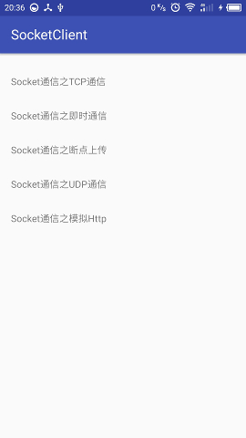

# SocketSamples
Socket学习笔记

Socket网络知识学习基础 [实现分析](http://blog.csdn.net/lj402159806/article/details/56290460)

Socket通信学习实例一之建立Socket连接 [实现分析](http://blog.csdn.net/lj402159806/article/details/56841817)

Socket通信学习实例二之即时通信 [实现分析](http://blog.csdn.net/lj402159806/article/details/56890909)

Socket通信学习实例三之断点上传 [实现分析](http://blog.csdn.net/lj402159806/article/details/57516498)

Socket通信学习实例四之UDP通信 [实现分析](http://blog.csdn.net/lj402159806/article/details/58589823)

Socket通信学习实例五之模拟Http [实现分析](http://blog.csdn.net/lj402159806/article/details/61428872)

